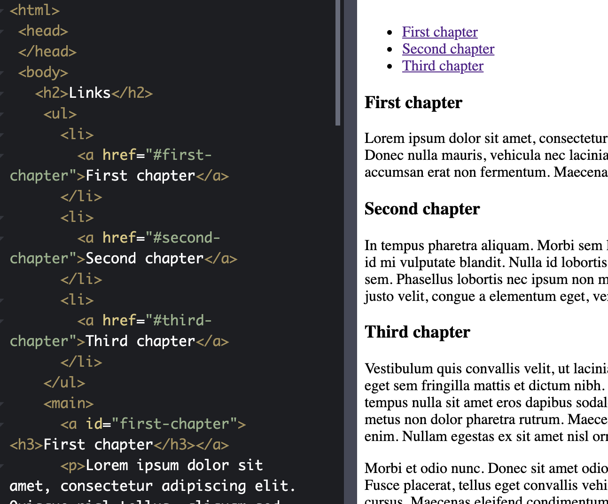

# HTML Exercises

## Headers

* Have 6 headers to make up the structure of the HTML document
* The smaller the number, the more important it is (and bigger)
* Typically have one h1 header with multiple h2 headers

## Semantic Blog Example

* Using semantic headers you can separate sections of the dcoument in a meaningful way


* Here we can see from the HTML tags that there is a clear navigation, main, and footer section from the ```<nav>, <main>, and <footer>``` tags

## Formatting Text

* Can add special emphasis on texts by utilizing the ```<strong> (bold) and <em> (italic)``` tags
* Can add separation using ```<br> and <hr>```
* Can add quotes by utilizing ```<blockquote>```

## Images

* Can load images utilizing the `````` tag
* Can set specific attributes on it


* The "width" attribute allows you to specify the width of the image
    * Height is automatically set so that the aspect ratio of the original picture is preserved
* Try to create images in the exact size that they will be utilized since the browser scales the images, but the original image will still be the same size which could lead to inefficiencies
* "alt" provides alternate text if the image fails to load
* "title" gives a title of the image when the mouse is hovered over it

## Tables

* Tables can easily be created using the ```<table>, <tr> (Table row), <td> (Table column)``` tags


* Tables can have other inline elements inside them such as text and images
* Tables can also nest other tables inside them as well

## Links

* Links are easily created using the ```<a>``` tags which stand for anchor
* Using these anchor tags, you can point to a URL outside the domain and also inside the domain



* In addition, you can add protocols like the "mailto:" protocol in front of the link to perform actions outside of redirecting
* Putting a "#" in front of the href allows it to point to something within the same page with that id
    * This means that there must be another ```<a>``` element with that "id"

## Head Tag Content

* In the head, there are a bunch of metadata that you can keep for the page
* Can add title with ```<title>``` which changes what the name shows up on browser tab
* Can add CSS styling and Javascript files
* Can also add meta tags that used by the browser, search engines, and social media


* Here the link and the script are referring to external files that are imported by the browser to load CSS and JS

## Create a Form

* Can create forms using the ```<form>``` tag
* Forms you define fields in the form of ```<input>``` tags
    * Many input types to choose from but usually "text" and "submit" are used
    * Submit is used to send the request to the server
* Forms have a "method" and "action" attribute
    * Method chooses what HTTP request method is utilized (default GET)
    * Action chooses where to send the request
* Fields are inline which mean that they won't be in their own block
    * Can wrap ```<p>``` tags around each field to give it the block aspect
* Can add additional attributes to each input such as "required" which makes the input required
* Ex.


